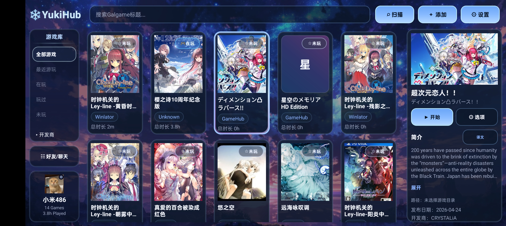
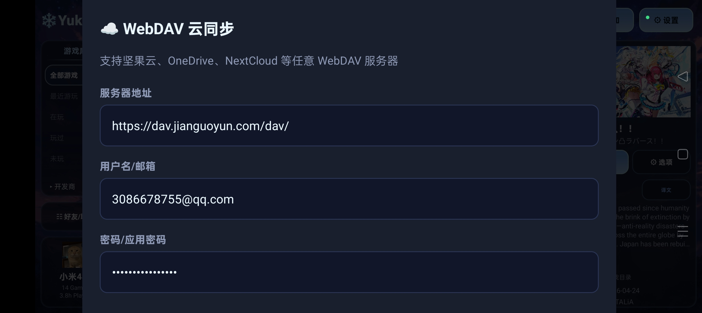
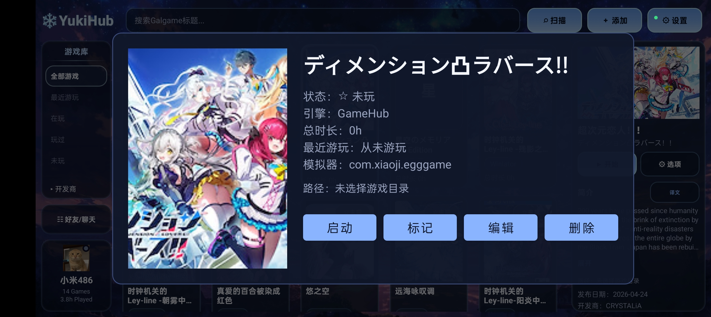

# YukiHub

  

  
  
  

**YukiHub** 是一款面向 Android 平台的游戏管理与启动工具，适合用于管理本地游戏、安卓应用型游戏入口、外部程序快捷方式以及游玩记录。

它的目标不是单纯做一个启动器，而是把“游戏库管理、快捷启动、数据同步、使用声明”整合到一个统一的深色界面中。

> 本项目采用 **GPL-3.0** 开源协议。

---

## 特性

- 支持添加、编辑、删除游戏条目
- 支持目录为空的游戏条目
  - 适用于安卓应用型游戏、外部程序、自定义启动项
- 支持 GameHub 快捷方式导入
  - 快捷方式列表支持图标显示
  - 支持搜索筛选
- 支持多种启动方式
- 支持本地游戏、安卓应用型条目和外部启动入口
- 支持游戏同步与导入导出
  - 支持游戏条目同步
  - 支持游玩记录同步
  - 支持空目录条目的匹配与恢复
- 支持设置内查看完整免责声明
- 首次启动时强制勾选同意免责声明后才能进入
- 深色风格界面，适合横屏使用

---

## 项目定位

YukiHub 更偏向于一个 **本地游戏管理中心**，而不是单纯的启动器。

它适合以下场景：

- 管理本地安装的游戏
- 管理安卓应用型游戏条目
- 管理外部启动入口
- 统一整理快捷方式
- 记录和同步游玩记录
- 在多设备之间迁移游戏数据

---

## 核心功能

### 1. 游戏管理
支持添加、编辑、删除游戏条目，并对不同类型的启动项进行统一管理。

### 2. 空目录条目支持
对于不需要本地目录的游戏或应用入口，可以不强制填写目录。

这对于以下场景尤其有用：

- 直接启动安卓应用
- 使用包名启动的条目
- 外部程序入口
- 自定义快捷启动项

### 3. GameHub 快捷方式导入
支持从 GameHub 中导入快捷方式，并提供：

- 图标显示
- 搜索筛选
- 更清晰的列表选择体验

### 4. 同步功能
支持游戏数据与游玩记录的同步导入导出，适合本地备份或多设备迁移。并且支持☁️WebDAV云同步功能。

同步时会尽量根据以下信息进行匹配：

- root 路径
- 本地 ID
- 游戏标题

对于空目录条目，会优先按标题进行匹配。

### 5. 免责声明体系
- 设置页可查看完整免责声明
- 首次启动必须勾选同意才能进入
- 便于开源发布和明确使用边界

---

## 截图

### 主界面

### 同步页面

### 游戏详情页

---

## 交流群

  

欢迎加入 QQ 交流群，反馈问题、提建议或一起讨论功能。

---

## 使用前说明

本项目内置免责声明机制，首次启动时需要勾选同意后才能继续使用。

请确保你仅用于管理和启动**你有权使用**的游戏、应用或资源。

本项目不提供：

- 游戏本体
- 破解资源
- 绕过授权的能力
- 任何违规用途的支持

---

## 系统要求

- Android 8.0 及以上
- 横屏体验更佳
- 需要部分文件访问权限
- 部分功能可能依赖系统兼容性或第三方组件支持

---

## 权限说明

本应用可能会请求以下权限：

- 文件读写权限
- 全盘文件访问权限
- 网络权限

用途说明：

- 文件权限：用于读取和管理游戏文件、目录与配置
- 网络权限：用于同步、联网资源或相关功能
- 全盘访问：用于某些目录型游戏管理场景

> 请仅在你明确理解并接受用途时授予权限。

---

## 安装方式

### 方法 1：直接安装 APK
从 Releases 页面下载 APK 并安装。

### 方法 2：自行编译
如果你想自己编译项目，请确保你已安装：

- Android Studio
- Android SDK
- Gradle 环境

然后打开项目并执行构建。

---

## 构建信息

- Application ID: `com.yuki.yukihub`
- Min SDK: `26`
- Target SDK: `33`
- Compile SDK: `33`
- 当前版本：`0.1`

---

## 已知说明

- 项目当前处于开源发布前后的持续打磨阶段
- 部分同步或云功能依赖外部服务可用性
- 某些兼容入口依赖设备环境与第三方应用支持

---

## 开源协议

本项目采用 **GNU General Public License v3.0 (GPL-3.0)** 开源。

你可以：

- 自由使用
- 自由修改
- 自由分发
- 在 GPL-3.0 约束下进行二次开发

请在遵守 GPL-3.0 协议的前提下使用本项目源码。

---

## 免责声明

本项目仅用于合法用途。

作者不对以下情况负责：

- 用户自身操作失误
- 第三方资源问题
- 系统兼容性问题
- 第三方服务不可用
- 由用户使用本软件产生的任何违规行为

请确保你仅用于管理和启动你有权使用的软件、游戏或资源。

---

## 致谢

感谢参考和学习的项目：

- krkr2
- Tyranor
- Beacon
- LunaBox
- Playnite

也感谢所有参与测试、反馈和建议的用户。

---

## 反馈与贡献

如果你在使用过程中遇到问题，欢迎提交 Issue 或 Pull Request。

你也可以在提交反馈时附上：

- 设备型号
- Android 版本
- 问题截图
- 复现步骤
- 日志信息

这样更方便定位问题。

---

## License

[GPL-3.0](./LICENSE)
